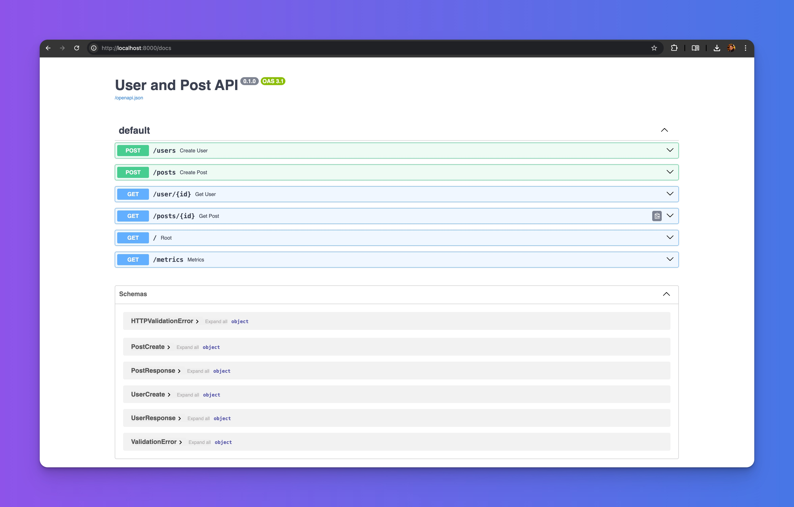
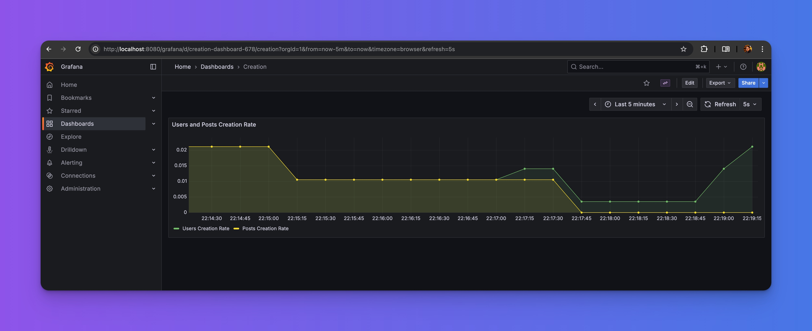
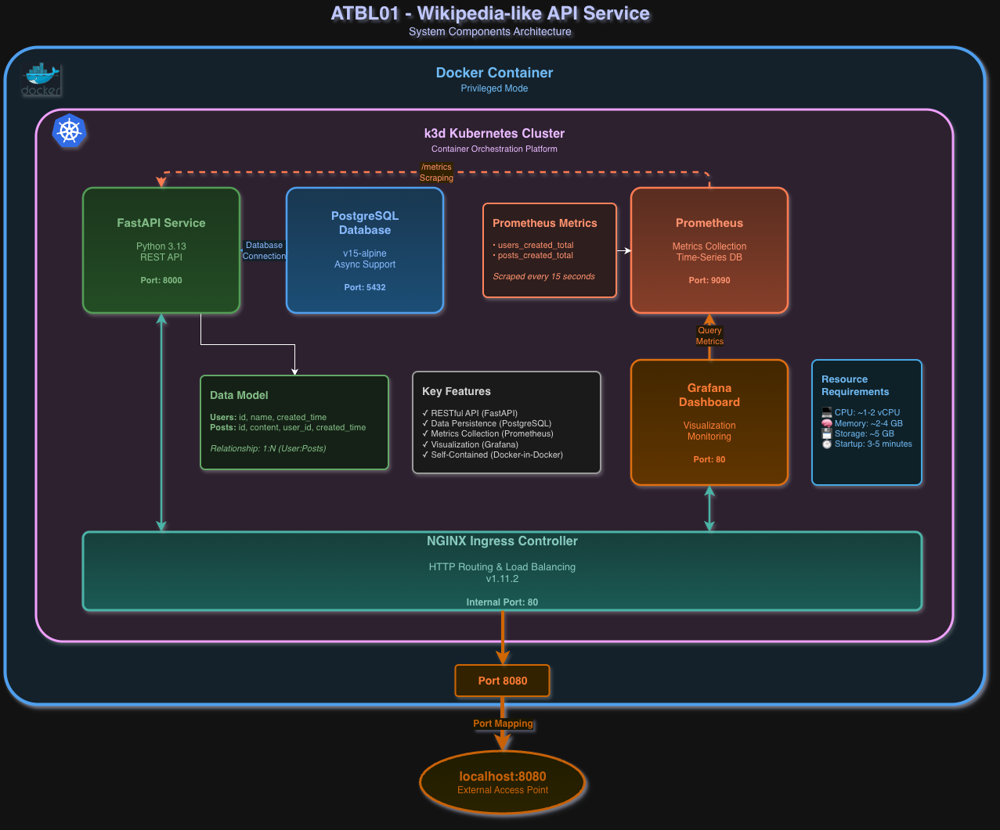

# ATBL01 - Wikipedia-like API Service

Containerized Wikipedia-like API service with user/post management, metrics collection, and visualization. Complete Kubernetes cluster running in a single Docker container using k3d (Docker-in-Docker).



## Features

- FastAPI REST service for users and posts management
- PostgreSQL with async support and proper relationships
- Prometheus metrics collection with pre-configured Grafana dashboards
- Kubernetes deployment with NGINX Ingress Controller in dedicated `wiki-app` namespace
- Self-contained k3d cluster in a single Docker container



## Architecture



### Stack

| Component | Technology | Purpose |
|-----------|-----------|---------|
| API | FastAPI (Python 3.13) | REST endpoints |
| Database | PostgreSQL 15-alpine | Async persistence |
| Metrics | Prometheus | Time-series collection |
| Visualization | Grafana | Dashboards |
| Orchestration | k3d v5.7.4 | Container orchestration |
| Ingress | NGINX v1.11.2 | HTTP routing |

### Data Model

**Users**: `id`, `name`, `created_time`
**Posts**: `id`, `content`, `user_id` (FK), `created_time`
**Metrics**: `users_created_total`, `posts_created_total`

### Resource Allocation

Resources consume ~70% of container capacity, leaving headroom for cluster components:

| Component | CPU Request | CPU Limit | Memory Request | Memory Limit | Storage |
|-----------|-------------|-----------|----------------|--------------|---------|
| FastAPI | 100m | 250m | 256Mi | 512Mi | - |
| PostgreSQL | 400m | 700m | 768Mi | 1280Mi | 2Gi |
| Prometheus | 250m | 450m | 600Mi | 1Gi | 2Gi |
| Grafana | 100m | 250m | 256Mi | 512Mi | 1Gi |
| **Total** | **~1.0 vCPU** | **~2.0 vCPU** | **~2GB** | **~4GB** | **~5GB** |

## Thoughts and Decisions

### Infrastructure Choices

**NGINX Ingress Controller**: Replaced k3d's default Traefik with NGINX to better reflect production Kubernetes environments and simplify debugging during evaluation.

**PostgreSQL Migration**: Migrated from SQLite to external PostgreSQL with async support (asyncpg), enabling proper production-like persistence and connection pooling.

**Dependency Management**: Chose standard pip + requirements.txt over uv/Poetry found in original project to avoid additional tooling complexity and maximize compatibility.

### Containerization Strategy

**Docker Layer Caching**: Ordered Dockerfile steps to maximize cache hits during iterative development. Avoided multi-stage builds as the complexity didn't justify benefits for this scope.

**Image Build Location**: Included wiki-service image build in `entrypoint.sh` instead of using a local registry. While less production-like, it simplifies the single-container deployment model for evaluation purposes.

**Entrypoint Design**: Prioritized verbose colored output and endpoint summary to facilitate testing and evaluation workflow.

### Helm Architecture

**Umbrella Chart Pattern**: All components (PostgreSQL, Prometheus, Grafana, FastAPI) as dependencies with centralized `values.yaml` configuration. Enables environment adaptation by swapping values files without template changes.

**Grafana Dashboard Automation**: Used sidecar pattern with ConfigMap containing pre-configured JSON dashboard, eliminating manual import steps.

**Namespace Isolation**: All components deployed to dedicated `wiki-app` namespace following production best practices. Provides logical isolation, simplifies RBAC/quota management, and prevents naming conflicts.

### Resource Management

**70% Allocation**: Set resource limits/requests to consume ~70% of container capacity (see table above), leaving headroom for k3d cluster components and preventing resource exhaustion in single-node configuration.

**Persistence Strategy**: Used k3d's local-path provisioner with PVCs to survive pod restarts while accepting ephemeral nature outside container lifecycle.

### Endpoint Exposure

Based on `test_api.sh` analysis, exposed all endpoints including `/metrics` (typically internal-only) to support complete testing and evaluation workflow.

## Quick Start

### Prerequisites

- Docker 20.10+
- 2 CPUs, 4GB RAM minimum
- 5GB disk space
- Port 8080 available

### Build & Run

```bash
docker build -t wiki-cluster .
docker run --privileged -p 8080:8080 --name wiki-cluster wiki-cluster
docker logs -f wiki-cluster
```

Startup takes 3-5 minutes. Wait for "Wiki Cluster is ready!" message.

### Endpoints

| Endpoint | URL | Description |
|----------|-----|-------------|
| Users API | http://localhost:8080/users/ | Create users |
| User Details | http://localhost:8080/user/{id} | Get user by ID |
| Posts API | http://localhost:8080/posts/ | Create posts |
| Post Details | http://localhost:8080/posts/{id} | Get post by ID |
| API Docs | http://localhost:8080/docs | Swagger UI |
| Metrics | http://localhost:8080/metrics | Prometheus endpoint |
| Grafana | http://localhost:8080/grafana/ | Dashboards (admin/admin) |
| Creation Dashboard | http://localhost:8080/grafana/d/creation-dashboard-678/creation | Pre-configured dashboard |

## Testing & Load Generation

### Automated Testing

The `wiki-service/test_api.sh` script was used throughout development to:

- **Validate cluster functionality** after each deployment
- **Generate traffic** for Grafana dashboard visualization
- **Stress test resource allocation** to verify the 70% limit threshold

**Usage:**

```bash
# From host (cluster must be running)
docker exec wiki-cluster bash -c "cd /workspace/wiki-service && chmod +x test_api.sh && ./test_api.sh"

# Or copy script to host and run
chmod +x wiki-service/test_api.sh
./wiki-service/test_api.sh
```

**Test Coverage:**

- Creates 3 users and 3 posts
- Tests GET endpoints for users/posts by ID
- Validates error handling (404 responses)
- Verifies Prometheus metrics collection
- Increments counters for dashboard visualization

**Continuous Load:**

```bash
# Generate continuous traffic for dashboard testing
while true; do
  curl -X POST http://localhost:8080/users \
    -H "Content-Type: application/json" \
    -d "{\"name\": \"User-$(date +%s)\"}"
  curl -X POST http://localhost:8080/posts \
    -H "Content-Type: application/json" \
    -d "{\"user_id\": 1, \"content\": \"Post at $(date)\"}"
  sleep 2
done
```

This generates steady creation rate metrics visible in the Grafana dashboard at http://localhost:8080/grafana/d/creation-dashboard-678/creation.

### Resource Validation

The 70% resource allocation was validated by:

1. Running test_api.sh repeatedly under load
2. Monitoring pod resource usage: `kubectl top pods`
3. Ensuring no OOM kills or CPU throttling
4. Verifying cluster stability over extended periods

## API Examples

### Create User

```bash
curl -X POST http://localhost:8080/users \
  -H "Content-Type: application/json" \
  -d '{"name": "Chris"}'
```

### Create Post

```bash
curl -X POST http://localhost:8080/posts \
  -H "Content-Type: application/json" \
  -d '{"content": "New Post", "user_id": 1}'
```

### View Metrics

```bash
curl http://localhost:8080/metrics | grep created_total
```

## Local Development

Run wiki-service standalone without k3d:

```bash
docker network create wiki-net

docker run -d --name postgres --network wiki-net \
  -e POSTGRES_USER=postgres -e POSTGRES_PASSWORD=postgres \
  -e POSTGRES_DB=wiki -p 5432:5432 postgres:15-alpine

docker build -t wiki-service wiki-service/

docker run -d --name wiki-service --network wiki-net -p 8000:8000 \
  -e DB_USER=postgres -e DB_PASSWORD=postgres \
  -e DB_HOST=postgres -e DB_PORT=5432 -e DB_NAME=wiki \
  wiki-service
```

Access at http://localhost:8000/docs

## Project Structure

```
/
├── Dockerfile                  # k3d cluster container
├── entrypoint.sh              # Cluster initialization
├── wiki-service/              # FastAPI application
│   ├── Dockerfile
│   ├── test_api.sh           # Automated test suite
│   └── app/
│       ├── main.py          # API endpoints
│       ├── models.py        # SQLAlchemy models
│       ├── schemas.py       # Pydantic schemas
│       ├── database.py      # PostgreSQL config
│       └── metrics.py       # Prometheus metrics
└── wiki-chart/               # Helm umbrella chart
    ├── Chart.yaml           # Dependencies manifest
    ├── values.yaml          # Centralized configuration
    ├── templates/           # K8s manifests
    └── dashboards/          # Grafana JSON
```

## Cluster Inspection

```bash
docker exec -it wiki-cluster bash

kubectl get pods,svc,ingress -n wiki-app
kubectl logs <pod-name> -n wiki-app
kubectl top pods -n wiki-app  # Resource usage
kubectl get namespaces  # List all namespaces
```

## Troubleshooting

**Container exits immediately**: Missing `--privileged` flag
**Port 8080 in use**: Change port mapping `-p 9080:8080`
**Services not accessible**: Wait 3-5 minutes for initialization
**OOM/slow performance**: Increase Docker resources to 4GB+ RAM
**Database errors**: Verify PostgreSQL pod is running

## Cleanup

```bash
docker stop wiki-cluster && docker rm wiki-cluster
docker rmi wiki-cluster wiki-service:latest
```

## Technical Notes

- **Helm**: Umbrella chart with Bitnami dependencies
- **Storage**: k3d local-path provisioner with PVCs (ephemeral outside container)
- **Security**: Hardcoded credentials for test environment only
- **Ingress**: NGINX replaces default Traefik for production similarity
- **Versions**: Latest charts used (test environment, not LTS)
- **Namespace**: All components deployed to dedicated `wiki-app` namespace for resource isolation
